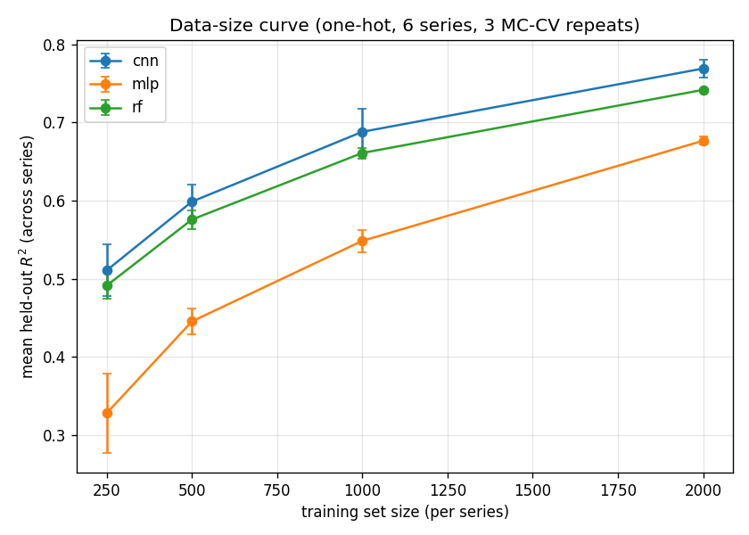

# Reproduction report — 2026-06-04-baseline

Scripted baseline reproduction of Nikolados et al. (2022) sequence-to-expression prediction. **No notebooks executed.**

- dataset_hash: `e15d854d7a648273...`  ·  split_hash: `c20f19717f3b0f38...`
- models: rf, mlp, cnn  ·  feature set: one-hot (96×4)
- series: 6 of 56 ([1, 2, 15, 20, 25, 26])
- MC-CV repeats (iterations): [1, 2, 3]  ·  train seed: 1
- primary metric: R² on each series' fixed held-out set, averaged across series then across repeats.

## Data-size curve

| model | train_size | r2_mean | r2_std |
| --- | --- | --- | --- |
| cnn | 250 | 0.5109 | 0.0334 |
| cnn | 500 | 0.5988 | 0.0221 |
| cnn | 1000 | 0.6882 | 0.029 |
| cnn | 2000 | 0.7692 | 0.0114 |
| mlp | 250 | 0.328 | 0.0509 |
| mlp | 500 | 0.4455 | 0.0169 |
| mlp | 1000 | 0.5486 | 0.0143 |
| mlp | 2000 | 0.6767 | 0.0052 |
| rf | 250 | 0.4914 | 0.0171 |
| rf | 500 | 0.5759 | 0.0121 |
| rf | 1000 | 0.6611 | 0.0068 |
| rf | 2000 | 0.7419 | 0.0005 |

## CNN vs classical @ train_size=2000

| model | r2_mean | r2_std |
| --- | --- | --- |
| cnn | 0.7692 | 0.0114 |
| rf | 0.7419 | 0.0005 |
| mlp | 0.6767 | 0.0052 |

## Notes

- R² increases with training-set size for every model (expected data-efficiency trend), reproducing the paper's qualitative finding.
- This is a **bounded** demo (subset of series/iterations) to satisfy the Milestone 2 exit criterion; the driver scales to all 56 series and 5 iterations via CLI flags.
- Per-(series,size,model,iteration) rows: see `experiments/runs/2026-06-04-baseline/metrics.csv`.
