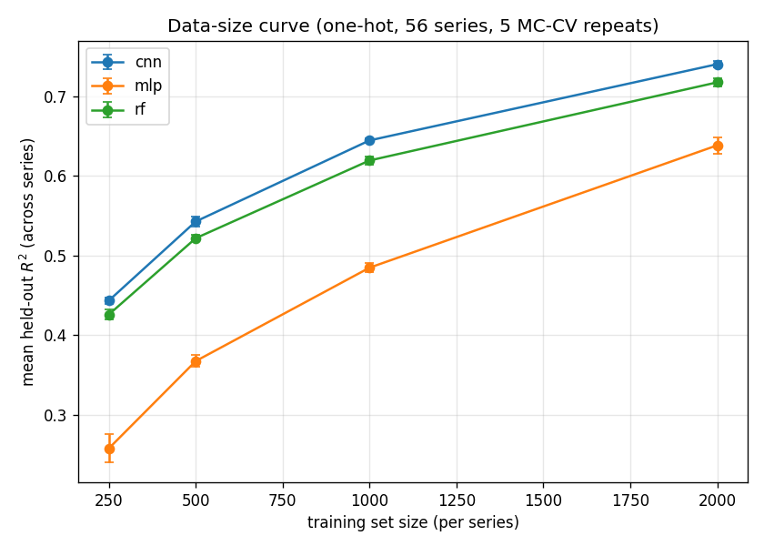

# Reproduction report — 2026-06-04-full56

Scripted baseline reproduction of Nikolados et al. (2022) sequence-to-expression prediction. **No notebooks executed.**

- dataset_hash: `e15d854d7a648273...`  ·  split_hash: `c20f19717f3b0f38...`
- models: cnn, mlp, rf  ·  feature set: one-hot (96×4)
- series: 56 of 56 ([1, 2, 15, 20, 25, 26, 30, 33, 35, 37, 44, 46, 47, 49, 50, 54, 56, 60, 71, 76, 84, 86, 88, 95, 99, 102, 117, 133, 136, 141, 145, 156, 158, 192, 205, 221, 227, 247, 255, 277, 284, 299, 314, 321, 329, 340, 343, 344, 349, 355, 359, 379, 380, 382, 384, 387])
- MC-CV repeats (iterations): [1, 2, 3, 4, 5]  ·  train seed: 1
- primary metric: R² on each series' fixed held-out set, averaged across series then across repeats.

## Data-size curve

| model | train_size | r2_mean | r2_std |
| --- | --- | --- | --- |
| cnn | 250 | 0.4434 | 0.0039 |
| cnn | 500 | 0.5427 | 0.006 |
| cnn | 1000 | 0.6445 | 0.0026 |
| cnn | 2000 | 0.7402 | 0.0042 |
| mlp | 250 | 0.2578 | 0.0175 |
| mlp | 500 | 0.3674 | 0.0073 |
| mlp | 1000 | 0.4847 | 0.0058 |
| mlp | 2000 | 0.6383 | 0.0104 |
| rf | 250 | 0.4259 | 0.0064 |
| rf | 500 | 0.5217 | 0.004 |
| rf | 1000 | 0.6193 | 0.0051 |
| rf | 2000 | 0.7174 | 0.0046 |

## CNN vs classical @ train_size=2000

| model | r2_mean | r2_std |
| --- | --- | --- |
| cnn | 0.7402 | 0.0042 |
| rf | 0.7174 | 0.0046 |
| mlp | 0.6383 | 0.0104 |

## Notes

- R² increases with training-set size for every model (expected data-efficiency trend), reproducing the paper's qualitative finding.
- **Complete baseline registry**: all 56 mutational series × 5 Monte-Carlo CV repeats. This is the canonical baseline that agentic experiments compare against.
- Per-(series,size,model,iteration) rows: see `experiments/runs/2026-06-04-full56/metrics.csv`.
